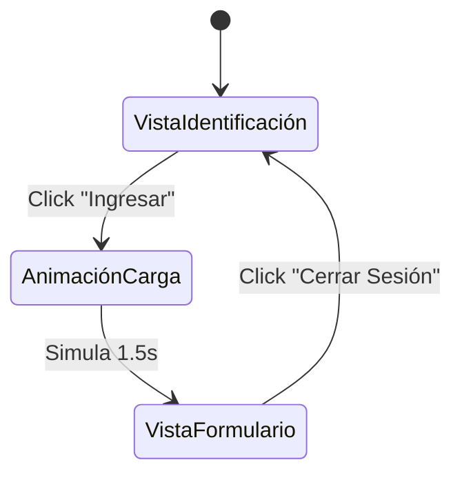

# Sistema Web de Control Docente EPIC - Parte 1 (UI/Maquetación)

Sistema tipo kiosco para la Universidad Privada de Tacna que digitaliza la "Ficha de Seguimiento de Avance Silábico" (Anexo C). Esta Parte 1 se enfoca exclusivamente en la interfaz visual con React + Tailwind CSS.

## Stack Tecnológico

| Tecnología | Versión | Propósito |
|---|---|---|
| React | 18+ | Framework UI (via Vite) |
| Tailwind CSS | 3.x | Sistema de estilos |
| Framer Motion | Latest | Animaciones y transiciones |
| Lucide React | Latest | Iconografía moderna |
| Google Fonts (Inter) | - | Tipografía premium |

## Arquitectura de Vistas

## Proposed Changes

### Inicialización del Proyecto

#### [NEW] Proyecto Vite + React + Tailwind
- Crear proyecto con `npx create-vite` configurado para React
- Instalar Tailwind CSS 3.x, Framer Motion, Lucide React
- Configurar `tailwind.config.js` con paleta institucional UPT (azul oscuro `#003366`, dorado `#C5A028`, blanco)

---

### Componentes de la Vista de Identificación

#### [NEW] `src/components/LoginView.jsx`
- Diseño centrado con fondo degradado institucional (azul oscuro → azul profundo)
- Logo/escudo UPT generado como SVG estilizado
- Input para DNI/Código del docente con validación visual (solo números, 8 dígitos)
- Botón "Ingresar" con efecto hover (escala + brillo), estado loading con spinner
- Animación de entrada con fade-in + slide-up
- Texto institucional: "UNIVERSIDAD PRIVADA DE TACNA" + "Sistema de Control de Avance Silábico"

---

### Componentes de la Vista de Formulario

#### [NEW] `src/components/FormView.jsx`
Componente principal del formulario que refleja EXACTAMENTE la estructura del Excel (Anexo C):

**Encabezado:**
- Banner institucional con título "FICHA DE SEGUIMIENTO DE AVANCE SILÁBICO"
- Nombre del docente ("Juan Pérez") + Reloj digital en tiempo real (HH:MM:SS)
- Botón "Cerrar Sesión" discreto

**Sección de Datos Institucionales (Solo Lectura):**
- Tarjetas con glassmorphism para: Facultad, Escuela Profesional, Carrera Profesional, Docente, Asignatura
- Campos visualmente destacados pero NO editables (fondo gris sutil, icono de candado)

**Sección del Formulario de Sesión (Campos editables):**
Siguiendo el orden EXACTO de las columnas del Excel:

| # | Campo | Componente |
|---|---|---|
| 1 | N° (Número de registro) | Auto-generado (readonly) |
| 2 | Aula / Laboratorio | `<input type="text">` |
| 3 | Fecha | `<input type="date">` (auto-llenado con fecha actual) |
| 4 | Unidad | `<select>` o `<input type="number">` (1-4) |
| 5 | N° de Semana Académica | `<select>` (1-17) |
| 6 | Tema Programado en el Sílabo | `<textarea>` |
| 7 | Recursos Utilizados | Checkboxes: Aula virtual, Proyector, Software especializado, Laboratorio, Bibliografía, Materiales, Equipos, Otros |
| 8 | Hora de Inicio de la Sesión | Botón "Registrar Inicio" (captura hora actual) |
| 9 | Hora de Finalización de la Sesión | Botón "Registrar Salida" (captura hora actual) |
| 10 | N° de Estudiantes Asistentes | `<input type="number">` |
| 11 | Validación de la Sesión | Badge de estado (Pendiente/Validada) |
| 12 | Observaciones | `<textarea>` opcional |

**Botones de Acción:**
- "Registrar Inicio de Clase" → Captura hora actual, muestra toast de confirmación
- "Registrar Salida" → Captura hora de salida, muestra toast de confirmación
- Ambos con estados visuales (activo/inactivo/completado)

---

### Utilidades y Componentes Compartidos

#### [NEW] `src/components/DigitalClock.jsx`
- Reloj digital en tiempo real con `setInterval` cada segundo
- Formato HH:MM:SS con tipografía monospace

#### [NEW] `src/components/Toast.jsx`
- Notificación flotante animada para confirmaciones
- Auto-dismiss después de 3 segundos

#### [NEW] `src/App.jsx`
- Estado principal: `currentView` ('login' | 'loading' | 'form')
- Transiciones animadas con Framer Motion `AnimatePresence`

#### [NEW] `src/index.css`
- Directivas de Tailwind + estilos globales
- Animaciones CSS custom (pulse, shimmer, slide-in)
- Scrollbar personalizado

---

### Paleta de Colores Institucional

| Token | Color | Uso |
|---|---|---|
| `primary-900` | `#001A33` | Fondo principal |
| `primary-800` | `#003366` | Azul institucional UPT |
| `primary-700` | `#004C99` | Hover/Active states |
| `accent-500` | `#C5A028` | Dorado institucional |
| `accent-400` | `#D4B84A` | Dorado hover |
| `surface` | `#FFFFFF` | Fondos de tarjetas |
| `surface-alt` | `#F8FAFC` | Fondos alternativos |
| `success` | `#10B981` | Estados exitosos |
| `warning` | `#F59E0B` | Alertas |

## Verificación

### Verificación Visual
- Ejecutar `npm run dev` y verificar ambas vistas en el navegador
- Comprobar transición animada entre Login → Loading → Formulario
- Verificar reloj digital en tiempo real
- Confirmar que todos los campos del Excel están representados
- Validar responsividad en resoluciones de pantalla de PC (1366x768, 1920x1080)

> [!IMPORTANT]
> **Esta es la Parte 1 - Solo UI/Maquetación.** No se implementará persistencia de datos, conexión a backend, ni localStorage. Los datos son estáticos/de prueba. La lógica de guardado se implementará en la Parte 2.
