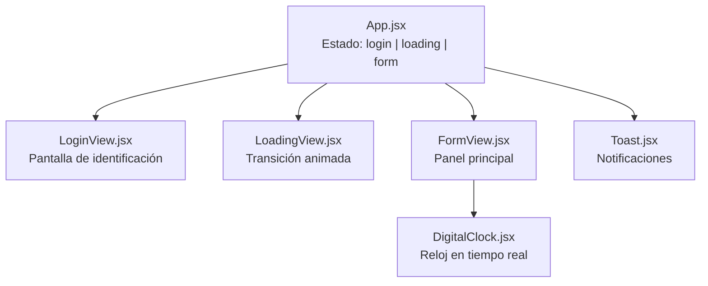

# 🎓 Sistema Web de Control Docente EPIC — Parte 1 Completada

## Vista de Login


> [!TIP]
> **Build exitoso** ✅ — La aplicación compila sin errores y el servidor de desarrollo está corriendo en `http://localhost:5173/`

---

## Arquitectura de Componentes



## Estructura de Archivos

```
control-docente/
├── index.html                  # Entry point con meta tags institucionales
├── tailwind.config.js          # Paleta granate institucional + animaciones
├── postcss.config.js           # PostCSS para Tailwind v3
├── package.json
└── src/
    ├── main.jsx                # React entry
    ├── App.jsx                 # Orquestador de vistas con AnimatePresence
    ├── index.css               # Tailwind directives + utilidades custom
    └── components/
        ├── LoginView.jsx       # Vista de identificación DNI
        ├── LoadingView.jsx     # Animación de carga (spinner + steps)
        ├── FormView.jsx        # Formulario completo del Anexo C
        ├── DigitalClock.jsx    # Reloj digital en tiempo real
        └── Toast.jsx           # Notificaciones tipo toast
```

## Campos del Formulario (Mapeo del Excel Anexo C)

| # | Campo del Excel | Componente React | Tipo |
|---|---|---|---|
| — | Facultad | `ReadOnlyCard` | Solo lectura 🔒 |
| — | Escuela Profesional | `ReadOnlyCard` | Solo lectura 🔒 |
| — | Carrera Profesional | `ReadOnlyCard` | Solo lectura 🔒 |
| — | Docente | `ReadOnlyCard` | Solo lectura 🔒 |
| 1 | N° de Registro | `<input>` readonly | Auto-generado |
| 2 | Aula / Laboratorio | `<input type="text">` | Editable |
| 3 | Fecha | `<input type="date">` | Auto-llenado |
| 4 | Asignatura | `<select>` | Seleccionable |
| 5 | Sección | `<input type="text">` | Editable |
| 6 | Unidad | `<select>` (I-IV) | Seleccionable |
| 7 | N° Semana Académica | `<select>` (1-17) | Seleccionable |
| 8 | Tema Programado | `<textarea>` | Editable |
| 9 | Recursos Utilizados | Checkboxes (8 opciones) | Multi-selección |
| 10 | Hora Inicio | Botón "Registrar Inicio" | Captura automática |
| 11 | Hora Finalización | Botón "Registrar Salida" | Captura automática |
| 12 | N° Estudiantes | `<input type="number">` | Editable |
| 13 | Validación | Badge de estado | Solo lectura 🔒 |
| 14 | Observaciones | `<textarea>` | Opcional |

## Paleta de Colores (basada en el logo EPIC)

| Color | Hex | Uso |
|---|---|---|
| 🟫 Granate 800 | `#7B2D2D` | Color principal institucional |
| 🟫 Granate 950 | `#3B0D0D` | Fondos oscuros |
| 🟫 Granate 600 | `#c92a2a` | Hover/Active |
| ⬜ Blanco | `#FFFFFF` | Superficies |
| 🔲 Slate | `#64748b` | Textos secundarios |

## Stack Tecnológico

| Paquete | Versión |
|---|---|
| Vite | 8.2.1 |
| React | 19.x |
| Tailwind CSS | 3.x |
| Framer Motion | Latest |
| Lucide React | Latest |

## Cómo Ejecutar

```bash
cd control-docente
npm run dev
# Abrir http://localhost:5173/
```

## Próximos Pasos (Parte 2)

- [ ] Integración con Google Sheets API
- [ ] Persistencia con localStorage
- [ ] Validación de campos antes del envío
- [ ] Lógica de búsqueda real del docente por DNI
- [ ] Integrar el logo real de EPIC (reemplazar placeholder)
